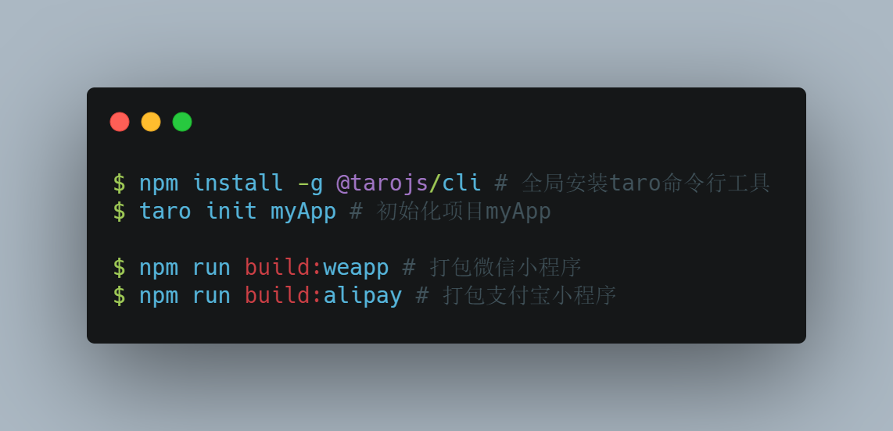

## <!-- fit --> Taro

> 多端统一开发解决方案

## 如何开发/维护一个双平台产品(微信小程序&支付宝小程序)

1) 方案一: 先开发一套支付宝小程序代码, 然后通过工具转微信小程序代码; 缺点: 转换后的代码多处报错, 仍然需要手动处理, 且转换后的代码可读性可维护性大大降低

1) 方案二: 先开发一套支付宝小程序代码, 然后手动转微信小程序代码; 缺点: 手动转换效率低, 而且以后产品迭代需要保持两套代码的同步更新, 时间一长很容易更新不同步的现象

1) 方案三: 使用第三方框架开发一套代码, 然后通过框架提供的工具转为不同平台的代码; 缺点: 学习成本稍高, 但是是目前最普遍的解决方案

## 市场上这类框架有哪些?

- Taro(京东): https://github.com/NervJS/taro
- uni-app(DCloud): https://github.com/dcloudio/uni-app
- mpvue(美团): https://github.com/Meituan-Dianping/mpvue
- chameleon(滴滴): https://github.com/didi/chameleon
- MPX(滴滴): https://github.com/didi/mpx
- megalo(网易考拉): https://github.com/kaola-fed/megalo

个人推荐: 综合各方面考虑(市场占用率, 社区活跃度, 更新频率, Issues 总量和解决比例等因素), 比较推荐 Taro 和 uni-app

- Taro: 使用 react 语法
- uni-app: 使用 vue 语法

## Taro 介绍

- Taro 是凹凸实验室(京东)开发的多端统一开发解决方案, 可以实现前端开发一套代码, 多平台适配
- 支持哪些平台? 微信小程序, 支付宝小程序, 百度小程序, 字节跳动小程序, QQ 小程序, 京东小程序, 快应用, H5, ReactNative
- 快应用: 9 大安卓手机厂商(华为、小米、OPPO、vivo、中兴、金立、联想、魅族、努比亚)共同推出的一套标准和平台, 可以在这些安卓手机上运行(免安装)
- ReactNative: 将 React 语法转为 APP 原生语法(Android/iOS), 基本上可以认为是原生 APP

## Taro 原理

- Taro 可以让开发者使用 React 语法开发项目, 最终通过 Taro 提供的编译工具将源码编译为: 微信小程序语法, 支付宝小程序语法...

## Taro 的优点(为什么用 Taro)

- 降低开发成本: 在不使用 Taro 前如果想开发一个微信小程序一个支付宝小程序, 需要开发维护两套代码, 使用 Taro 后只需要维护一套代码即可
- 支持更多的新语法: ES6, ES7, ES8, TypeScript, React-Hooks
- 丰富的工具/类库可以选择: Less, Sass, Redux
- API 调用更方便: Taro 使用 Promsie 封装小程序 API, ajax 增加了请求/响应拦截器等, 开发起来更加方便
- 现成的 UI 组件: 官方和第三方开发者提供的大量的组件, 项目中可以直接引入使用, 降低了开发成本
- 良好的技术支持: 遇到技术问题可以去论坛咨询, Github 提 Issues, 官方微信群

## Taro 的缺点

- 仅对微信小程序 API 支持度较高: 其他如支付宝小程序 API 有很多都不支持, 可以将微信和支付宝相似 API 封装为公共方法
- 使用小程序官方组件库不太方便: 比如支付宝官方组件库只支持支付宝小程序, 如果在 Taro 中使用就需要考虑其他平台是否支持了, 这里推荐官方 Taro 组件库, 或其他第三方的 Taro 组件库
- 某些平台独有 API/配置需要单独处理: 不同平台的小程序还是有区别的, 比如支付宝支持`transparentTitle: 'auto'`属性, 微信不支持
- bug 比原生小程序多: 但是还好, 基本上通过各种渠道都找到解决办法了, 目前还没有遇到解决不了的问题

## Taro 项目初始化&打包

## Taro 开发注意事项

> 语雀文章: https://www.yuque.com/vrr9x6/tve0yz/qnyg9d

## 总结(主观感受)

- 整体感觉: 还是比较优秀的一款框架, 需要一定的学习成本, 在开发效率上略低于小程序原生语法(开发成本大概是原生语法的 1.3 倍), 但是考虑多平台小程序, 开发效率上肯定是好过维护支付宝/微信两套代码的
- 有利于开发者自身的技术提升: 可以使用 ES 新语法, Sass/Less 工具, 可以用 React, TypeScript, 以后再开发 H5 的时候也不会感觉生疏

## News 最新消息

- Taro3.0 正式版已于 7 月 1 日发布, 同时支持 React, Vue, jQuery

## <!-- fit --> Thank You
