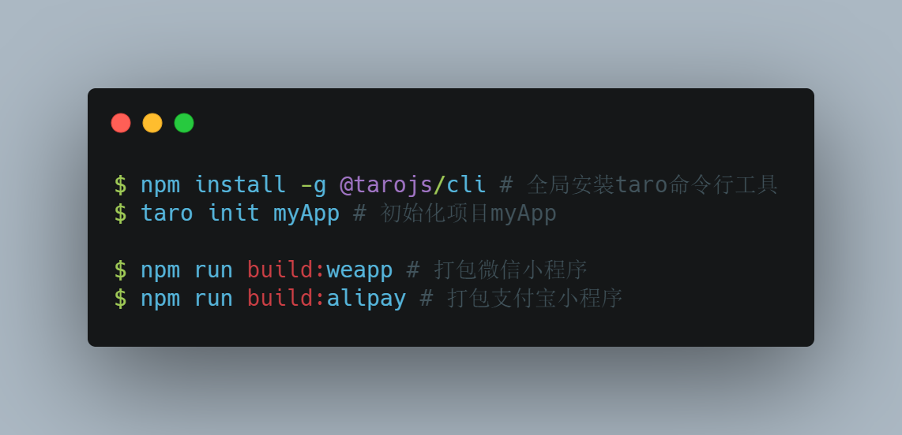

## <!-- fit --> Taro

<!-- 大家下午好, 今天给大家介绍一款前端的框架, Taro -->

> 多端统一开发解决方案

## 首先讲一个工作中遇到的问题

掌上加油支付宝小程序

> 加油业务线有一款产品"掌上加油", 它是一个支付宝小程序, 有一天我们来了一个需求, 要求"掌上加油"运行在微信端。 首先我们要知道支付宝小程序肯定是没有办法运行在微信端的? 那我们是手动将支付宝小程序改造成微信小程序, 但是从那以后我们就需要维护两套代码了: 那就意味着维护的成本增加, 还有我们的产品一般都是敏捷开发, 需求有时候比较着急, 就可能出现更新不同步的情况, 我们也在一直在努力解决这个问题。

## <!-- fit --> 有没有办法解决?

## 尝试: 

> 一开始的思路: 有没有一种工具可以直接帮我们把支付宝小程序转成微信小程序, 这样我们只需要维护支付宝小程序即可, 每次迭代后用工具转成微信小程序? 抱着这种想法, 我们在Github上找到了一款工具[Antmove](https://github.com/ant-move/Antmove), 但是使用过后发现转换后的代码仍然有很多处报错, 需要你手动去处理, 并且转换后的代码可读性和可维护性都变得很差; 并没有达到我们理想的效果, 这个方案就被我们pass掉了

## 另外一种选择

> 使用第三方框架开发, 这也是目前比较普遍的解决方案, 使用框架开发能做到: 开发者只需要维护这一套代码即可, 大大降低了维护成本, 避免了多套代码更新不同步现象;

## 目前市场上有哪些框架呢?

> 我找了热度排名前6的几款框架, 有兴趣的可以去他们Github上面了解一下

- Taro(京东): https://github.com/NervJS/taro
- uni-app(DCloud): https://github.com/dcloudio/uni-app
- mpvue(美团): https://github.com/Meituan-Dianping/mpvue
- chameleon(滴滴): https://github.com/didi/chameleon
- MPX(滴滴): https://github.com/didi/mpx
- megalo(网易考拉): https://github.com/kaola-fed/megalo

经过对比, 综合考虑: 包括市场占用率, 社区活跃度, 框架更新频率, bug总量和解决比例等因素, 个人比较推荐 Taro 和 uni-app 两款框架, 这两款也是目前使用人数最多的

- Taro: 使用 react 语法
- uni-app: 使用 vue 语法

## 使用框架开发前需要了解

- 框架开发一般只适合新项目: 因为它需要你用框架搭建项目, 使用框架支持的语法进行开发, 那我们"掌上加油"如果想用的话, 就需要重写了, 考虑重写的成本太高所以一直没有用
- 最近的一个需求"油荟通小程序", 这个项目比较小, 而且是从0开发, 所有我们在这次的项目中使用了Taro框架进行开发

## 为什么选 Taro

1. 热度高: [2019年 Github 中国区活跃度第5名](https://www.infoq.cn/article/dCY0AHH71rBBjq3pIfh7)

    > 意味着: 使用这款框架的人数多, 能被你遇到的坑基本上都被别人踩过了, 所以解决起来比较容易

2. 大厂背书: Taro 是凹凸实验室(京东)开发的多端统一开发解决方案。

    > 不用太担心停止维护的问题, 就算京东不维护了, 社区的活跃度这么高, 也会有大批的人出来维护的
  
3. 支持的平台多: 微信小程序, 支付宝小程序, 百度小程序, 字节跳动小程序, QQ 小程序, 京东小程序, H5, 快应用, ReactNative
   <!-- 前面的小程序和H5我想大家应该都了解, 这里简单介绍一下后面这两个 -->
    - 快应用: 轻量级安卓 APP(免安装)
    - ReactNative: Facebook出品, 基本上可以认为是原生 APP(Android/iOS)

## Taro 的优点

1. 降低多平台维护成本(最主要优势): ❎维护多套代码; ✅维护一套代码;

1. 支持更多的新语法: ES6, ES7, ES8, TypeScript, React-Hooks...
    <!-- 这里我们做开发的应该深有体会, 新技术学完过段时间就忘, 但是用几次就熟悉了 -->

2. 丰富的工具/类库可以选择: Less, Sass, Redux...
3. API 调用更方便, 扩展了更多功能: Taro 使用 Promsie 封装小程序 API, 给 ajax 增加了拦截器...
4. 封装好的 UI 组件: 官方和第三方开发者提供的大量的组件, 项目中可以直接引入使用, 降低了开发成本
5. 良好的技术支持, 三种渠道: 论坛, Github, 官方微信群
    <!-- 提一下: 我在开发中遇到的问题基本上都能从Github或者技术博客上找到的答案 -->

## Taro 的缺点

> 夸完优点我们再说说缺点

1. API 支持度不足: 除了微信小程序外, 其他如支付宝小程序有很多 API 是不支持的, 但是可以自己[封装](https://www.yuque.com/vrr9x6/tve0yz/rpyy2x)

1. 平台独有 API/配置/组件需要单独处理: 当使用平台独有的 API 或配置时, 需要单独用条件处理避免报错; 应避免使用小程序官方组件, 如果使用了支付宝官方组件, 那么在打包微信小程序的时候就会报错, 推荐 Taro 官方组件库
1. bug 比原生小程序多: 但是还好, 基本上通过各种渠道都能找到解决办法
1. 某些情况 Taro 性能会略低于原生小程序: [Taro 对比原生开发](https://nervjs.github.io/taro/blog/2020-04-27-taro-vs-jd/)

## Taro 原理

> 它底层是如何实现一套代码支持多平台呢?

- 我们前面提到: Taro 可以让开发者使用 React 语法进行开发, 最终通过 Taro 的编译工具将源码编译为: 微信小程序, 支付宝小程序...

- 了解一下编译过程(Babel同理): 将项目源码解析（Parse）成抽象语法树（AST），然后根据不同插件对 AST 进行转换(Transform)（类似 DOM 树的操作），生成（generate）新的 AST，根据新的 AST 生成编译后的代码(小程序/H5/ReactNative...)

## Taro 项目初始化&打包

<!-- 这里可以给大家演示一下打包过程, 项目初始化就不演示了, 那个下载依赖太花时间 -->

<!--  -->

## Taro 开发注意事项

> 这里是我第一次在项目中使用Taro的时候遇到的坑, 总结了一篇文章

- 语雀: https://www.yuque.com/vrr9x6/tve0yz/qnyg9d

## 总结

- Taro 最大优势: 降低了项目的维护成本

- 而且对个人技术的提升非常有帮助: 可以用ES新语法, React, Hooks, Redux, Sass, TypeScript等开发。
- 小程序开发/H5开发无缝切换: 长期开发原生小程序, 再去开发H5的时候总会有生疏感, 而当你将以上技术应用到H5开发的时候, 可以让你在小程序开发和H5开发做到无缝切换

- 说说我的整体感觉: Taro 还是比较优秀的一款框架, 但是需要一定的学习成本
- 只适合新项目: 旧项目想用的话就需要重写代码了

## News 最新消息

- Taro3.0 正式版已于 7 月 1 日发布, 同时支持 React, Vue, jQuery;

- 想使用Vue开发的小伙伴可以先熟悉熟悉新版本, 我还是建议等它更新 2~3 个版本再用到项目中, 目前大版本迭代是会有很多问题

## <!-- fit --> Thank You
